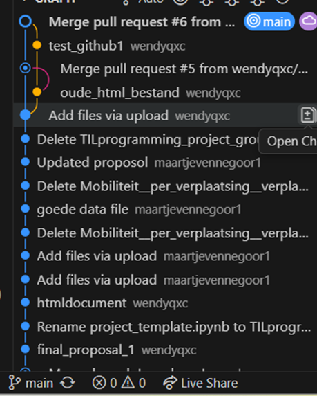

# Group8
Github repository for group 8 of the TIL Python Programming course (TIL6022-2025) 

**Oct 13**: *Do not delete or update in the Github repository on the internet, only in VS code!*
We have updated all the different branches with commits behind (or ahead). If you click on the problem icon with the x and danger sign next to your branch (see image below, here it says "main"), go to the terminal.

At the terminal you can write:
- git checkout main #to go into the main branch
- git pull origin main  #get the latest from github 
- git checkout [insert branch name] #switch to feature branche *[use this one every time you want to merge your code from your branch to the main branch]*
- git merge main    #merge main into the branch you want *[use this one every time you want to merge your code from your branch to the main branch]*
- click on sync changes in the source control panel on the left, to have it up to date *[use this one every time you want to merge your code from your branch to the main branch]*
